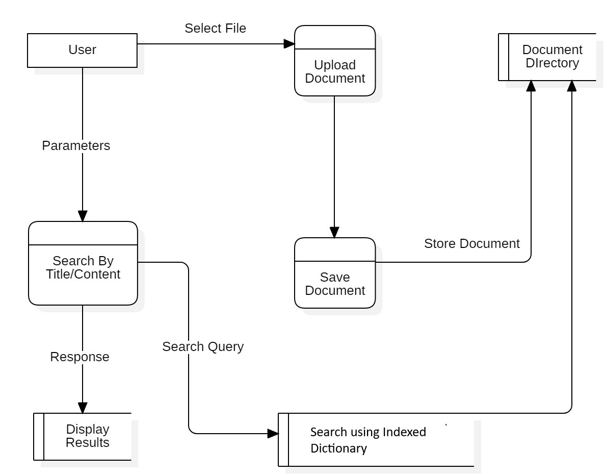

# DOCUMENT SEARCH ENGINE


## Session: 2021 – 2025

### Submitted by:

**Abdul Mateen**
*2021-CS-190*

### Submitted to:

**Dr. Khaldoon**

---

## Department of Computer Science

University of Engineering and Technology
Lahore, Pakistan

---

# Document Search Engine - Comprehensive Explanation

## Introduction

This document provides a comprehensive explanation of the Document Search Engine, including its architecture, data flow, and modular code representation. The system allows users to upload documents, search for content or filenames, and retrieve matching results.

## Overview

The Document Search Engine is built using Django and Python. It enables users to upload documents , index their content, and perform efficient searches. Results are presented with matching filenames and content snippets.

## Tech Stack

- **Django**: A web framework for Python to build web applications.
- **HTML/CSS**: For frontend to create the user interface.
- **JavaScript**: For handling dynamic interactions (e.g., PDF viewer integration).
- **Math**: For computing TF-IDF, cosine similarity, and other mathematical operations.

---

# Installation Guide

Follow these steps to set up the project from scratch.

### Clone the Project

```
git clone https://github.com/abdulmateenzwl/Information-Retrieval.git
cd Information-Retrieval
cd "Assignment 1"
```

### Create a Virtual Environment

Create a virtual environment to manage your project dependencies:

```bash
python3 -m venv venv
```

Activate the virtual environment:

```
venv\Scripts\activate
```

Install Required Dependencies
Install all necessary Python libraries using pip. You can use the requirements.txt file to install the dependencies:

```
pip install -r requirements.txt
```

### Directory Structure

Ensure your project has the following directory structure:

```
project_root/
│
├── manage.py                     # Django project management script
├── requirements.txt              # Python dependencies (optional)
├── db.sqlite3                    # SQLite database (or any other database in use)
│
├── static/                       # Static files (CSS, JavaScript, images)
│   ├── css/
│   ├── js/
│   └── images/
│
├── templates/                    # HTML templates
│   ├── base.html                 # Base template for layout inheritance
│   └── search_engine/
│       └── search.html
│
├── media/                        # Media files (user uploads)
│
├── search_engine/                      # Main project folder (same name as the project)
│   ├── __init__.py
│   ├── asgi.py
│   ├── settings.py               # Project settings
│   ├── urls.py                   # Project-level URL configuration
│   ├── wsgi.py
│   └── static/                   # Optional: project-level static files
│
├── search_engine/                     # Django app directory
│   ├── migrations/               # Database migrations
│   │   ├── __init__.py
│   │   └── 0001_initial.py
│   ├── static/                   # App-specific static files
│   │   └── search_engine/
│   │       ├── css/
│   │       └── js/
│   ├── templates/                # App-specific templates
│   │   └── search_engine/
│   │       └── example.html
│   ├── __init__.py
│   ├── admin.py                  # Admin site configuration
│   ├── apps.py                   # App configuration
│   ├── models.py                 # Database models
│   ├── tests.py                  # Unit tests
│   ├── views.py                  # Views (business logic)
│   ├── urls.py                   # App-specific URL configuration
│   └── forms.py                  # Optional: Django forms
│
└── docs/                         # Documentation (optional)
    ├── README.md
    └── PPT.ppt
```

### Running the Application

Run the Django application with the following command:

```
python manage.py runserver
```

The app will be accessible at http://localhost:8000/.

# Project Overview

## Core Features

### File Uploading:

- Users can upload `.txt` files. These documents are saved in the `documents/` directory.
- Uploaded files are processed immediately to extract their content, which is stored in the `documents` dictionary.

### Document Indexing:

- The app uses the **TF-IDF model** to index documents by content.
- Stop words are removed from the indexing process to ensure only meaningful terms are indexed.
- Cosine similarity is used to rank documents based on the relevance of the search query.

### Search Functionality:

- Users can search for keywords or phrases within document content or filenames.
- The search results are ranked by relevance, with the most relevant results displayed first.

---

## Code Explanation

### Main Application (`main.py`)

#### Import Statements

```python
from django.shortcuts import render
from .utils import read_documents, keyword_matching, calculate_tf_idf
```

#### Django Setup

```python
INSTALLED_APPS = [
    'search_engine',
    'django.contrib.admin',
    'django.contrib.auth',
    'django.contrib.contenttypes',
    'django.contrib.sessions',
    'django.contrib.messages',
    'django.contrib.staticfiles',
]
```

#### Global Variables

```python
# Initialize indexes when the server starts
INDEX, TITLE_INDEX, DOCUMENTS = build_index()
```

#### Document Reading

The read_documents function reads and processes all text files in a specified upload directory and stores their content in a global dictionary for indexing and search operations.

Example:

```python
{
  "file1.txt": {"content": "Text file content"},
  "file2.txt": {"content": "Second Doc"},
  "file3.txt": {"content": "Third Doc"}
}
```

### Working

#### Build Index

```py
def build_index():
    """
    Build indexes for quick searching.
    - `index`: Maps words to the documents they appear in.
    - `title_index`: Maps document titles to their full content.
    - `documents`: Stores the complete content of all documents.
    """
    index = defaultdict(list)
    title_index = {}
    documents = {}

    # Loop through files in the DOCUMENTS_DIR
    for filename in os.listdir(DOCUMENTS_DIR):
        file_path = os.path.join(DOCUMENTS_DIR, filename)
        if os.path.isfile(file_path) and filename.endswith('.txt'):
            with open(file_path, 'r', encoding='utf-8') as f:
                content = f.read()
                title_index[filename] = content
                documents[filename] = content
                # Tokenize and index each word
                words = content.split()
                for word in words:
                    index[word.lower()].append(filename)
    return index, title_index, documents
```

#### Search 

```py
def find_matching_lines(query, documents):
    """
    Find lines in documents that contain the query.
    :param query: The word or phrase to search for.
    :param documents: A dictionary of document names and their content.
    :return: A list of dictionaries with document names and matching lines.
    """
    query_lower = query.lower()
    matching_lines = []

    # Search each document's content for the query
    for doc_name, content in documents.items():
        lines = content.splitlines()
        for line in lines:
            if query_lower in line.lower():
                # Highlight the query in the matching line
                highlighted_line = re.sub(
                    re.escape(query),
                    f"<mark>{query}</mark>",
                    line,
                    flags=re.IGNORECASE
                )
                matching_lines.append({"document": doc_name, "line": highlighted_line.strip()})
    
    return matching_lines
```

#### Upload File
```python
@csrf_exempt
def upload_file_view(request):
    """
    Handle file uploads.
    Accepts .txt files and updates the index upon successful upload.
    """
    if request.method == 'POST' and request.FILES.get('file'):
        uploaded_file = request.FILES['file']

        # Validate the uploaded file type
        if not uploaded_file.name.endswith('.txt'):
            return JsonResponse({'success': False, 'message': 'Only .txt files are allowed.'})

        # Save the file to the DOCUMENTS_DIR
        file_path = os.path.join(DOCUMENTS_DIR, uploaded_file.name)
        with open(file_path, 'wb') as f:
            for chunk in uploaded_file.chunks():
                f.write(chunk)

        # Update the index with the new file
        update_index(file_path, uploaded_file.name)

        return JsonResponse({'success': True, 'message': 'File uploaded and index updated successfully.'})

    # Respond with an error for invalid requests
    return JsonResponse({'success': False, 'message': 'Invalid request.'})

```

## DFD



#### Explanation

**Overview**
This DFD depicts a system designed for managing and retrieving documents. It illustrates how users interact with the system to upload, store, and search for documents.

**Components**

* **Search By Title/Content:** Process that takes user-provided parameters (search query) and searches the Document Directory for matching documents.
* **Save Document:** Process that saves the document in the Document Directory.
* **Search using Keyword Matching:** Process that employs keyword matching to find documents containing the search query.
* **Display Results:** Process that displays search results to the user.

**Data Flows**

* **Select File:** User selects a file for upload.
* **Store Document:** Uploaded document is stored in the Document Directory.
* **Parameters:** User provides parameters (search query) to the search process.
* **Search Query:** Search query is passed to the search process.
* **Response:** Search results are displayed to the user.

**Functionality**

1. **Document Upload:** User selects a file for upload. The system receives the file and stores it in the Document Directory.
2. **Document Search:** User provides a search query (by title or content). The system searches the Document Directory using keyword matching to find documents containing the search query.
3. **Display Results:** System displays the search results to the user, highlighting the matching lines in the document content.

## Future Enhancements

In the future, we plan to enhance the document search engine by supporting various document formats beyond plain text files. This includes adding support for PDF, Word, and Excel documents, allowing users to upload and search within these file types. Additionally, we aim to improve the search algorithms to provide more accurate and relevant results, and to integrate advanced features such as natural language processing and semantic search capabilities. These enhancements will make the search engine more versatile and powerful, catering to a wider range of user needs and document types.