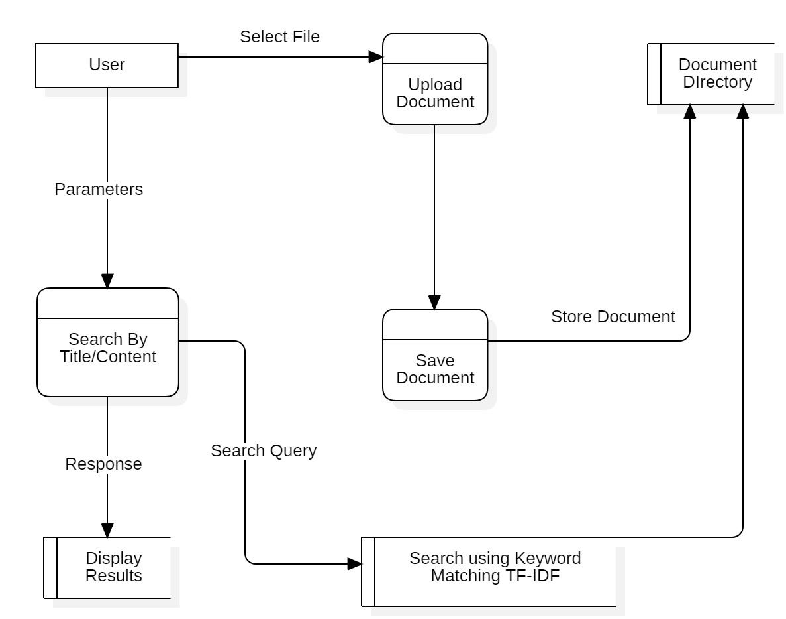

# DOCUMENT SEARCH ENGINE

(TF-IDF)

## Session: 2021 – 2025

### Submitted by:

**Abdul Mateen**
*2021-CS-190*

### Submitted to:

**Dr. Khaldoon**

---

## Department of Computer Science

University of Engineering and Technology
Lahore, Pakistan

---

# Document Search Engine - Comprehensive Explanation

## Introduction

This document provides a comprehensive explanation of the Document Search Engine, including its architecture, data flow, and modular code representation. The system allows users to upload documents, search for content or filenames, and retrieve matching results.

## Overview

The Document Search Engine is built using Django and Python. It enables users to upload documents , index their content, and perform efficient searches. Results are presented with matching filenames and content snippets.

## Tech Stack

- **Django**: A web framework for Python to build web applications.
- **HTML/CSS**: For frontend to create the user interface.
- **JavaScript**: For handling dynamic interactions (e.g., PDF viewer integration).
- **Math**: For computing TF-IDF, cosine similarity, and other mathematical operations.

---

# Installation Guide

Follow these steps to set up the project from scratch.

### Clone the Project

```
git clone https://github.com/abdulmateenzwl/Information-Retrieval.git
cd Information-Retrieval
cd "Assignment 2"
```

### Create a Virtual Environment

Create a virtual environment to manage your project dependencies:

```bash
python3 -m venv venv
```

Activate the virtual environment:

```
venv\Scripts\activate
```

Install Required Dependencies
Install all necessary Python libraries using pip. You can use the requirements.txt file to install the dependencies:

```
pip install -r requirements.txt
```

### Directory Structure

Ensure your project has the following directory structure:

```
project_root/
│
├── manage.py                     # Django project management script
├── requirements.txt              # Python dependencies (optional)
├── db.sqlite3                    # SQLite database (or any other database in use)
│
├── static/                       # Static files (CSS, JavaScript, images)
│   ├── css/
│   ├── js/
│   └── images/
│
├── templates/                    # HTML templates
│   ├── base.html                 # Base template for layout inheritance
│   └── ranking/
│       └── search.html
│
├── media/                        # Media files (user uploads)
│
├── ranking/                      # Main project folder (same name as the project)
│   ├── __init__.py
│   ├── asgi.py
│   ├── settings.py               # Project settings
│   ├── urls.py                   # Project-level URL configuration
│   ├── wsgi.py
│   └── static/                   # Optional: project-level static files
│
├── ranking/                     # Django app directory
│   ├── migrations/               # Database migrations
│   │   ├── __init__.py
│   │   └── 0001_initial.py
│   ├── static/                   # App-specific static files
│   │   └── ranking/
│   │       ├── css/
│   │       └── js/
│   ├── templates/                # App-specific templates
│   │   └── ranking/
│   │       └── example.html
│   ├── __init__.py
│   ├── admin.py                  # Admin site configuration
│   ├── apps.py                   # App configuration
│   ├── models.py                 # Database models
│   ├── tests.py                  # Unit tests
│   ├── views.py                  # Views (business logic)
│   ├── urls.py                   # App-specific URL configuration
│   └── forms.py                  # Optional: Django forms
│
└── docs/                         # Documentation (optional)
    ├── README.md
    └── PPT.ppt
```

### Running the Application

Run the Flask application with the following command:

```
python manage.py runserver
```

The app will be accessible at http://localhost:3000/.

# Project Overview

## Core Features

### File Uploading:

- Users can upload `.txt` files. These documents are saved in the `ranking/documents/` directory.
- Uploaded files are processed immediately to extract their content, which is stored in the `documents` dictionary.

### Document Indexing:

- The app uses the **TF-IDF model** to index documents by content.
- Stop words are removed from the indexing process to ensure only meaningful terms are indexed.
- Cosine similarity is used to rank documents based on the relevance of the search query.

### Search Functionality:

- Users can search for keywords or phrases within document content or filenames.
- The search results are ranked by relevance, with the most relevant results displayed first.

---

## Code Explanation

### Main Application (`main.py`)

#### Import Statements

```python
from django.shortcuts import render
from .utils import read_documents, keyword_matching, calculate_tf_idf
```

#### Django Setup

```python
INSTALLED_APPS = [
    'ranking',
    'django.contrib.admin',
    'django.contrib.auth',
    'django.contrib.contenttypes',
    'django.contrib.sessions',
    'django.contrib.messages',
    'django.contrib.staticfiles',
]
```

#### Global Variables

```python
# Global variables to store documents and their index
documents = {}
index = {}
tf_index = {}  # Stores term frequencies for each document
idf_values = {}  # Stores IDF values for terms
```

#### Document Reading

The read_documents function reads and processes all text files in a specified upload directory and stores their content in a global dictionary for indexing and search operations.

Example:

```python
{
  "file1.txt": {"content": "Text file content"},
  "file2.txt": {"content": "Second Doc"},
  "file3.txt": {"content": "Third Doc"}
}
```

### Working

#### Keyword Matching

```python
def keyword_matching(query, documents):
    """Rank documents based on keyword matching."""
    query_words = query.lower().split()
    rankings = []
    for doc_name, content in documents.items():
        doc_words = content.lower().split()
        match_count = sum(word in doc_words for word in query_words)
        rankings.append((doc_name, match_count))
    return sorted(rankings, key=lambda x: x[1], reverse=True)
```

#### Document Indexing

The create_index function generates an inverted index and computes term frequency (TF) and inverse document frequency (IDF) values for a collection of documents.

Example:
Files:

```
file1.txt: "apple banana apple"
file2.txt: "banana orange"

```

TF:

```python
Copy code
file1.txt: {'apple': 0.67, 'banana': 0.33}
file2.txt: {'banana': 0.5, 'orange': 0.5}
```

Inverted Index:

```python
Copy code
{'apple': ['file1.txt'], 'banana': ['file1.txt', 'file2.txt'], 'orange': ['file2.txt']} 
```

IDF Values:

```python
Copy code
{'apple': log(1.5), 'banana': log(1.5), 'orange': log(1.5)}
```

## DFD



#### Explanation

**Overview**
This DFD depicts a system designed for managing and retrieving documents. It illustrates how users interact with the system to upload, store, and search for documents.

**Components**

* **User:** Represents the end-user who interacts with the system.
* **Upload Document:** Process responsible for receiving documents from the user and storing them in the Document Directory.
* **Document Directory:** Storage location for uploaded documents.
* **Search By Title/Content:** Process that takes user-provided parameters (search query) and searches the Document Directory for matching documents.
* **Save Document:** Process that saves the document in the Document Directory.
* **Search using Keyword Matching TF-IDF:** Process that employs the TF-IDF technique to rank matching documents based on the search query.
* **Display Results:** Process that displays search results to the user.

**Data Flows**

* **Select File:** User selects a file for upload.
* **Parameters:** User provides parameters (search query) to the search process.
* **Search Query:** Search query is passed to the search process.
* **Response:** Search results are displayed to the user.
* **Store Document:** Uploaded document is stored in the Document Directory.

**Functionality**

1. **Document Upload:** User selects a file for upload. The system receives the file and stores it in the Document Directory.
2. **Document Search:** User provides a search query (by title or content). The system searches the Document Directory using TF-IDF to rank matching documents.
3. **Display Results:** System displays the ranked search results to the user.


## Future Enhancements
 In the future, we plan to enhance the document search engine by supporting various document formats beyond plain text files. This includes adding support for PDF, Word, and Excel documents, allowing users to upload and search within these file types. Additionally, we aim to improve the search algorithms to provide more accurate and relevant results, and to integrate advanced features such as natural language processing and semantic search capabilities. These enhancements will make the search engine more versatile and powerful, catering to a wider range of user needs and document types.