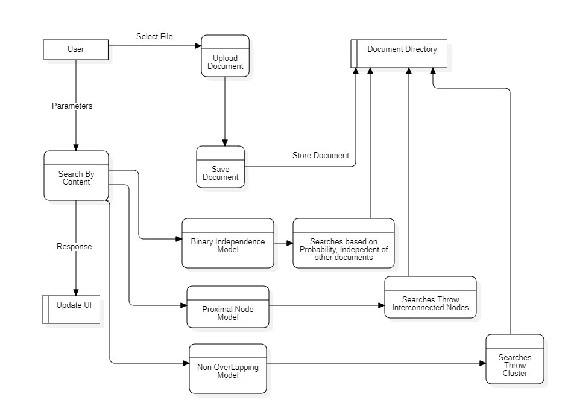
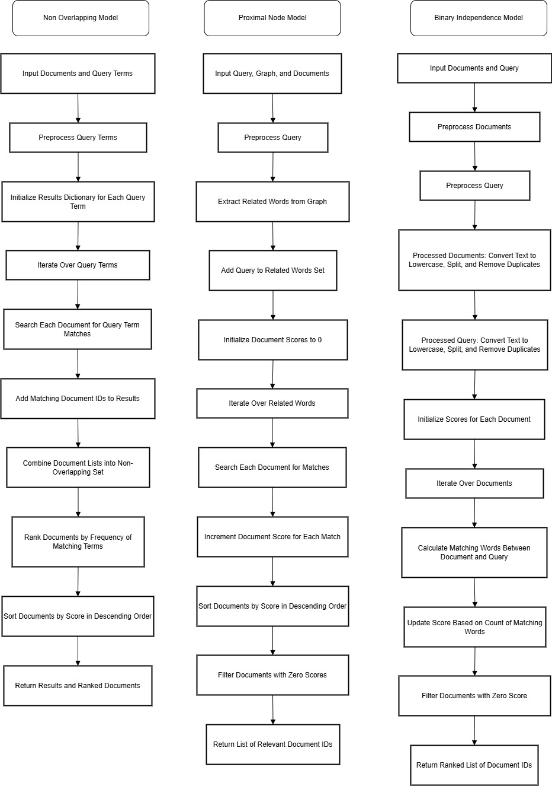

# DOCUMENT SEARCH ENGINE

## Session: 2021 – 2025

### Submitted by:

**Abdul Mateen**
*2021-CS-190*

### Submitted to:

**Dr. Khaldoon**

---

## Department of Computer Science

University of Engineering and Technology
Lahore, Pakistan

---

# Document Search Engine  

## Introduction  

This document provides a comprehensive explanation of the Document Search Engine, including its architecture, data flow, and modular code representation. The system allows users to upload documents, index their content, and perform efficient searches using various retrieval models. Results are presented with matching filenames and content snippets, ranked by relevance.  

---

## Overview  

The Document Search Engine is a Django-based application built using Python. It enables users to upload and process documents, apply advanced search algorithms, and retrieve results ranked by relevance. The engine incorporates three primary models for search: the Binary Independence Model, Non-Overlapped Lists, and Proximal Nodes.  


## Tech Stack

- **Django**: A web framework for Python to build web applications.
- **HTML/CSS**: For frontend to create the user interface.
- **JavaScript**: For handling dynamic interactions (e.g., PDF viewer integration).
- **Math**: For computing, cosine similarity, and other mathematical operations.

---

# Installation Guide

Follow these steps to set up the project from scratch.

### Clone the Project

```
git clone https://github.com/abdulmateenzwl/Information-Retrieval.git
cd Information-Retrieval
cd "Assignment 3"
```

### Create a Virtual Environment

Create a virtual environment to manage your project dependencies:

```bash
python3 -m venv venv
```

Activate the virtual environment:

```
venv\Scripts\activate
```

Install Required Dependencies
Install all necessary Python libraries using pip. You can use the requirements.txt file to install the dependencies:

```
pip install -r requirements.txt
```

### Directory Structure

Ensure your project has the following directory structure:

```
project_root/
│
├── manage.py                     # Django project management script
├── requirements.txt              # Python dependencies (optional)
├── db.sqlite3                    # SQLite database (or any other database in use)
│
├── static/                       # Static files (CSS, JavaScript, images)
│   ├── css/
│   ├── js/
│   └── images/
│
├── templates/                    # HTML templates
│   ├── base.html                 # Base template for layout inheritance
│   └── search_engine/
│       └── search.html
│
├── media/                        # Media files (user uploads)
│
├── search_engine/                      # Main project folder (same name as the project)
│   ├── __init__.py
│   ├── asgi.py
│   ├── settings.py               # Project settings
│   ├── urls.py                   # Project-level URL configuration
│   ├── wsgi.py
│   └── static/                   # Optional: project-level static files
│
├── search_engine/                     # Django app directory
│   ├── migrations/               # Database migrations
│   │   ├── __init__.py
│   │   └── 0001_initial.py
│   ├── static/                   # App-specific static files
│   │   └── search_engine/
│   │       ├── css/
│   │       └── js/
│   ├── templates/                # App-specific templates
│   │   └── search_engine/
│   │       └── example.html
│   ├── __init__.py
│   ├── admin.py                  # Admin site configuration
│   ├── apps.py                   # App configuration
│   ├── models.py                 # Database models
│   ├── tests.py                  # Unit tests
│   ├── views.py                  # Views (business logic)
│   ├── urls.py                   # App-specific URL configuration
│   └── forms.py                  # Optional: Django forms
│
└── docs/                         # Documentation (optional)
    ├── README.md
    └── PPT.ppt
```

### Running the Application

Run the Django application with the following command:

```
python manage.py runserver
```

The app will be accessible at http://localhost:8000/.
## Project Overview  

### Core Features  

#### **File Uploading**  

- Users can upload `.txt` files, which are saved in the `documents/` directory.  
- Uploaded files are immediately processed, and their content is stored in a dictionary for efficient indexing and retrieval.  

#### **Document Indexing**  

- The app preprocesses documents to normalize content by converting text to lowercase, removing duplicates, and splitting it into individual terms.  
- Documents are indexed using advanced models like the **Binary Independence Model**, **Non-Overlapped List Model**, and **Proximal Nodes Retrieval** to enable specialized search functionality.  

---

## Search Models  

The Document Search Engine incorporates three distinct search models to offer flexibility and accuracy in content retrieval:  

### **1. Binary Independence Model (BIM)**  
The Binary Independence Model calculates the relevance of a document based on its overlap with the search query.  

**Key Features:**  
- Preprocesses the query and documents to remove case sensitivity and normalize content.  
- Scores documents based on the count of matching terms between the query and document.  
- Filters out documents with minimal matching terms to ensure relevance.  

**Implementation Workflow:**  
1. Tokenize and preprocess all documents and the query.  
2. Calculate the number of query terms that overlap with each document.  
3. Rank the documents based on their overlap scores, discarding documents with a score of zero.  

---

### **2. Non-Overlapped List Model**  
This model retrieves documents based on individual query terms and organizes them into separate non-overlapping lists for each term.  

**Key Features:**  
- Splits the search query into individual terms.  
- Identifies documents containing each term independently.  
- Groups results into a dictionary where each query term maps to a list of document IDs containing that term.  

**Implementation Workflow:**  
1. Tokenize the search query into terms.  
2. Search each term within the document content.  
3. Return a mapping of query terms to document IDs for precise result segregation.  

---

### **3. Proximal Nodes Model**  
The Proximal Nodes Model uses a predefined graph structure to identify related terms and locate documents based on the relationships between words.  

**Key Features:**  
- Incorporates a graph structure that maps terms to their semantically related terms.  
- Matches documents containing either the query term or its related terms from the graph.  
- Enhances the retrieval process by considering semantic proximity rather than exact matches.  

**Implementation Workflow:**  
1. Retrieve related terms for the query term from the graph.  
2. Search for the query term and related terms across all documents.  
3. Return a dictionary of relevant document IDs and their content.  

### File Uploading:

- Users can upload `.txt` files. These documents are saved in the `documents/` directory.
- Uploaded files are processed immediately to extract their content, which is stored in the `documents` dictionary.

### Document Indexing:

- The app uses the **TF-IDF model** to index documents by content.
- Stop words are removed from the indexing process to ensure only meaningful terms are indexed.
- Cosine similarity is used to rank documents based on the relevance of the search query.

### Search Functionality:

- Users can search for keywords or phrases within document content or filenames.
- The search results are ranked by relevance, with the most relevant results displayed first.


### **Search Results**  

- Results are ranked by relevance based on the search model applied.  
- For models like BIM, results are sorted by overlap scores, with higher scores indicating better matches.  
- Non-Overlapped Lists and Proximal Nodes return well-organized lists or mappings of documents to ensure clear and relevant results.  

---

## Example Use Case  

1. **Uploading Documents:**  
   A user uploads a collection of `.txt` files containing textual content. These documents are indexed and stored in the system.  

2. **Performing a Search:**  
   The user enters a query and selects the desired search model (BIM, Non-Overlapped Lists, or Proximal Nodes).  

3. **Retrieving Results:**  
   The system processes the query using the chosen model and displays ranked results with filenames and content snippets.  

---

## Technical Details  

- **Programming Language:** Python  
- **Framework:** Django  
- **Search Algorithms:**  
  - Binary Independence Model  
  - Non-Overlapped List Model  
  - Proximal Nodes Retrieval  
- **Data Storage:** Files are stored in the `documents/` directory, and their content is stored in a Python dictionary for efficient processing.  
- **Preprocessing:** Tokenization, case normalization, and duplicate removal ensure consistent and clean data for indexing.  

---

## Code Explanation

### Main Application (`main.py`)

#### Import Statements

```python
from django.shortcuts import render
from .utils import read_documents, keyword_matching, calculate_tf_idf
```

#### Django Setup

```python
INSTALLED_APPS = [
    'search_engine',
    'django.contrib.admin',
    'django.contrib.auth',
    'django.contrib.contenttypes',
    'django.contrib.sessions',
    'django.contrib.messages',
    'django.contrib.staticfiles',
]
```

#### Global Variables

```python
# Initialize indexes when the server starts
INDEX, TITLE_INDEX, DOCUMENTS = build_index()
```

#### Document Reading

The read_documents function reads and processes all text files in a specified upload directory and stores their content in a global dictionary for indexing and search operations.

Example:

```python
{
  "file1.txt": {"content": "Text file content"},
  "file2.txt": {"content": "Second Doc"},
  "file3.txt": {"content": "Third Doc"}
}
```


### Working

#### Build Index

```py
def build_index():
    """
    Build indexes for quick searching.
    - `index`: Maps words to the documents they appear in.
    - `title_index`: Maps document titles to their full content.
    - `documents`: Stores the complete content of all documents.
    """
    index = defaultdict(list)
    title_index = {}
    documents = {}

    # Loop through files in the DOCUMENTS_DIR
    for filename in os.listdir(DOCUMENTS_DIR):
        file_path = os.path.join(DOCUMENTS_DIR, filename)
        if os.path.isfile(file_path) and filename.endswith('.txt'):
            with open(file_path, 'r', encoding='utf-8') as f:
                content = f.read()
                title_index[filename] = content
                documents[filename] = content
                # Tokenize and index each word
                words = content.split()
                for word in words:
                    index[word.lower()].append(filename)
    return index, title_index, documents
```

#### Search  By Proximal Nodes

```py
def retrieve_proximal_nodes_from_graph(query, graph, documents):
    """
    Retrieve documents based on proximal nodes from a predefined graph.

    Parameters:
        - query_word: The word input by the user.
        - graph: A dictionary mapping words to their related words.
        - documents: A dictionary of document IDs and their content.

    Returns:
        - A dictionary of relevant document IDs and their content.
    """
    # Preprocess query to extract related words
    query = query.lower()
    related_words = set(graph.get(query, []))  # Get related words from the graph
    related_words.add(query)  # Include the query itself in related words

    # Dictionary to store document scores
    doc_scores = {doc_id: 0 for doc_id in documents}

    # Search documents containing any of the related words and calculate scores
    for word in related_words:
        for doc_id, content in documents.items():
            if word in content.lower():  # Case-insensitive matching
                doc_scores[doc_id] += 1  # Increment score for each match

    # Sort documents by score in descending order
    ranked_docs = sorted(doc_scores.items(), key=lambda item: item[1], reverse=True)

    # Filter out documents with a score of 0 and return only their IDs
    return [doc_id for doc_id, score in ranked_docs if score > 0]

```

#### Search  By non Overlapping lists

```py
def non_overlapped_lists(documents, query_terms):
    """
    Non-Overlapped List Model for Information Retrieval.
    
    Args:
        documents (dict): A dictionary where keys are document IDs and values are document content.
        query_terms (list): A list of terms to search for in the documents.

    Returns:
        dict: A dictionary where keys are terms and values are lists of document IDs containing that term.
    """
    # Preprocess query terms (case-insensitive matching)
    query_terms = [term.lower() for term in query_terms]
    
    # Dictionary to store results for each query term
    results = {term: [] for term in query_terms}

    # Search documents for each query term
    for term in query_terms:
        for doc_id, content in documents.items():
            if term in content.lower():  # Case-insensitive matching
                results[term].append(doc_id)

    # Combine all document lists into a non-overlapping set
    combined_docs = set()
    for doc_list in results.values():
        combined_docs.update(doc_list)

    # Rank combined documents by frequency of matching terms
    doc_scores = {doc_id: 0 for doc_id in combined_docs}
    for term, doc_list in results.items():
        for doc_id in doc_list:
            doc_scores[doc_id] += 1  # Increment score for each term match

    # Sort documents by score in descending order
    ranked_docs = sorted(doc_scores.items(), key=lambda item: item[1], reverse=True)

    val =  {"term_results": results, "ranked_documents": [doc_id for doc_id, _ in ranked_docs]}
    print(val)
    return val
```

#### Search By Binary Independence Model 

```py
# Binary Independence Model implementation
def calculate_bim(documents, query):
    """
    Binary Independence Model for information retrieval.

    Args:
        documents (dict): A dictionary where keys are document IDs and values are the text of the documents.
        query (str): The search query.

    Returns:
        list: Ranked list of document IDs based on relevance scores.
    """
    print(documents)
    # Preprocess the documents and query
    def preprocess(text):
        # Simple preprocessing: convert to lowercase, split into words, remove duplicates
        return set(text.lower().split())

    processed_documents = {doc_id: preprocess(content) for doc_id, content in documents.items()}
    processed_query = preprocess(query)

    # Calculate scores for each document
    scores = {}
    for doc_id, words in processed_documents.items():
        # Count matching words
        matching_words = processed_query.intersection(words)
        scores[doc_id] = len(matching_words)  # Score based on count of matching words

    # Filter documents with a score of zero
    zero_score_docs = [doc_id for doc_id, score in scores.items() if score == 1]

    return zero_score_docs
```

#### Upload File
```python
@csrf_exempt
def upload_file_view(request):
    """
    Handle file uploads.
    Accepts .txt files and updates the index upon successful upload.
    """
    if request.method == 'POST' and request.FILES.get('file'):
        uploaded_file = request.FILES['file']

        # Validate the uploaded file type
        if not uploaded_file.name.endswith('.txt'):
            return JsonResponse({'success': False, 'message': 'Only .txt files are allowed.'})

        # Save the file to the DOCUMENTS_DIR
        file_path = os.path.join(DOCUMENTS_DIR, uploaded_file.name)
        with open(file_path, 'wb') as f:
            for chunk in uploaded_file.chunks():
                f.write(chunk)

        # Update the index with the new file
        update_index(file_path, uploaded_file.name)

        return JsonResponse({'success': True, 'message': 'File uploaded and index updated successfully.'})

    # Respond with an error for invalid requests
    return JsonResponse({'success': False, 'message': 'Invalid request.'})

```

## DFD




#### Explanation

**Overview**
This DFD depicts a system designed for managing and retrieving documents. It illustrates how users interact with the system to upload, store, and search for documents.

**Components**

* **Search By Title/Content:** Process that takes user-provided parameters (search query) and searches the Document Directory for matching documents.
* **Save Document:** Process that saves the document in the Document Directory.
* **Search using Keyword Matching:** Process that employs keyword matching to find documents containing the search query.
* **Display Results:** Process that displays search results to the user.

**Data Flows**

* **Select File:** User selects a file for upload.
* **Store Document:** Uploaded document is stored in the Document Directory.
* **Parameters:** User provides parameters (search query) to the search process.
* **Search Query:** Search query is passed to the search process.
* **Response:** Search results are displayed to the user.

**Functionality**

1. **Document Upload:** User selects a file for upload. The system receives the file and stores it in the Document Directory.
2. **Document Search:** User provides a search query (by title or content). The system searches the Document Directory using keyword matching to find documents containing the search query.
3. **Display Results:** System displays the search results to the user, highlighting the matching lines in the document content.


**Components**:

* User: Represents the end-user who interacts with the system.
* Upload Document: This process receives documents from the user and stores them in the Document Directory.
* Document Directory: This is where uploaded documents are stored.
* Search By Content: This process takes parameters (search query) from the user and searches the Document Directory for matching documents.
* Save Document: This process saves the document in the Document Directory.
* Binary Independence Model: Searches based on probability, independent of other documents.
* Proximal Node Model: Searches through interconnected nodes.
* Non-Overlapping Model: Searches through clusters.

**Data Flows**:
* Select File: The user selects a file to upload.
* Parameters: The user provides parameters (search query) to the search process.
* Search Query: The search query is passed to the search process.
* Response: The search results are displayed to the user.
* Store Document: The uploaded document is stored in the Document Directory.

**Functionality**:
* Document Upload: The user selects a file to upload. The system receives the file and stores it in the Document Directory.
* Document Search: The user provides a search query. The system searches the Document Directory using different models (Binary Independence, Proximal Node, and Non-Overlapping) to rank the matching documents.
* Display Results: The system displays the ranked search results to the user.

## Future Enhancements

In the future, we plan to enhance the document search engine by supporting various document formats beyond plain text files. This includes adding support for PDF, Word, and Excel documents, allowing users to upload and search within these file types. Additionally, we aim to improve the search algorithms to provide more accurate and relevant results, and to integrate advanced features such as natural language processing and semantic search capabilities. These enhancements will make the search engine more versatile and powerful, catering to a wider range of user needs and document types.