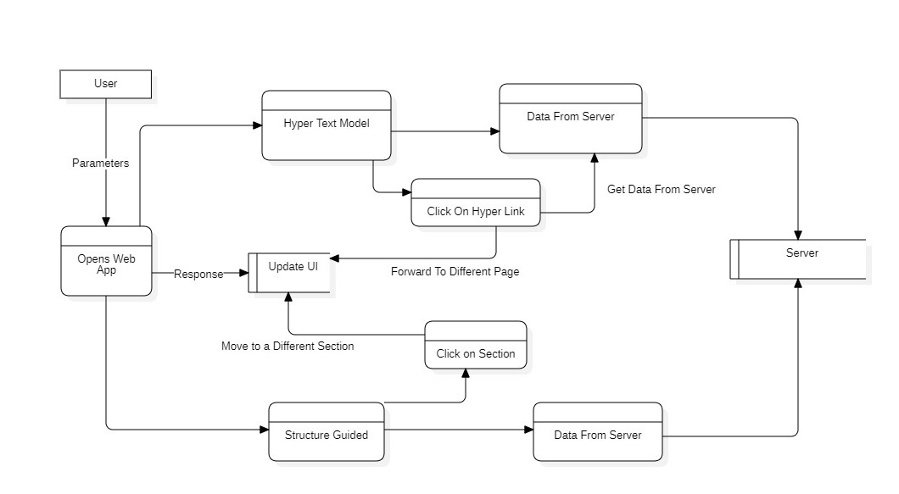

# DOCUMENT SEARCH ENGINE

## Session: 2021 – 2025

### Submitted by:

**Abdul Mateen**
*2021-CS-190*

### Submitted to:

**Dr. Khaldoon**

---

## Department of Computer Science

University of Engineering and Technology
Lahore, Pakistan

---

# Hypertext and Structure Guided Model  

## Introduction  

This document provides a detailed explanation of the Hypertext and Structure Guided Model, its architecture, data flow, and modular implementation. The system facilitates hypertext-based search functionality, enabling users to query structured content and retrieve contextually relevant results based on hypertext and semantic relationships.  

---

## Overview  

The Hypertext and Structure Guided Model is a Python-based application designed for querying and exploring structured documents with hypertext links. It leverages the relationships between nodes (documents, terms, or sections) to guide the search process, providing a context-aware retrieval experience. The system uses advanced algorithms to rank search results based on their relevance, hypertext connections, and structural properties.


## Tech Stack

- **Django**: A web framework for Python to build web applications.
- **HTML/CSS**: For frontend to create the user interface.
- **JavaScript**: For handling dynamic interactions (e.g., PDF viewer integration).

---

## Installation Guide

Follow these steps to set up the project from scratch.

### Clone the Project

```
git clone https://github.com/abdulmateenzwl/Information-Retrieval.git
cd Information-Retrieval
cd "Assignment 4"
```

### Create a Virtual Environment

Create a virtual environment to manage your project dependencies:

```bash
python3 -m venv venv
```

Activate the virtual environment:

```bash
venv\Scripts\activate
```

Install Required Dependencies
Install all necessary Python libraries using pip. You can use the requirements.txt file to install the dependencies:

```bash
pip install -r requirements.txt
```

### Directory Structure

Ensure your project has the following directory structure:

```
project_root/
│
├── manage.py                     # Django project management script
├── requirements.txt              # Python dependencies (optional)
├── db.sqlite3                    # SQLite database (or any other database in use)
│
├── static/                       # Static files (CSS, JavaScript, images)
│   ├── css/
│   ├── js/
│   └── images/
│
├── templates/                    # HTML templates
│   ├── base.html                 # Base template for layout inheritance
│   └── search_engine/
│       └── slides.html
│       └── hypertext.html
│
├── media/                        # Media files (user uploads)
│
├── search_engine/                      # Main project folder (same name as the project)
│   ├── __init__.py
│   ├── asgi.py
│   ├── settings.py               # Project settings
│   ├── urls.py                   # Project-level URL configuration
│   ├── wsgi.py
│   └── static/                   # Optional: project-level static files
│
├── search_engine/                     # Django app directory
│   ├── migrations/               # Database migrations
│   │   ├── __init__.py
│   │   └── 0001_initial.py
│   ├── static/                   # App-specific static files
│   │   └── search_engine/
│   │       ├── css/
│   │       └── js/
│   ├── templates/                # App-specific templates
│   │   └── search_engine/
│   │       └── slides.html
│   ├── __init__.py
│   ├── admin.py                  # Admin site configuration
│   ├── apps.py                   # App configuration
│   ├── models.py                 # Database models
│   ├── tests.py                  # Unit tests
│   ├── views.py                  # Views (business logic)
│   ├── urls.py                   # App-specific URL configuration
│   └── forms.py                  # Optional: Django forms
│
└── docs/                         # Documentation (optional)
    ├── README.md
    └── PPT.ppt
```

### Running the Application

Run the Django application with the following command:

```
python manage.py runserver
```

The app will be accessible at http://localhost:8000/.
## Project Overview  

### Core Features  

#### **Hypertext Graph Construction**  

- Documents are represented as nodes, and hypertext links between them are represented as edges.  
- Nodes store content and metadata, while edges capture semantic relationships.  

---
## Search Models  

The system integrates two main models for searching hypertext documents:  

### **1. Hypertext-Based Search**  

This model prioritizes documents based on their hypertext connectivity.  

**Key Features:**  
- Represents documents and terms as nodes in a graph.  
- Uses graph traversal techniques to identify relevant documents.  
- Considers the importance of nodes based on in-degree, out-degree, and PageRank.  

**Implementation Workflow:**  
1. Parse documents to construct a hypertext graph.  
2. Use a query to identify starting nodes and traverse the graph.  
3. Rank documents based on connectivity metrics like PageRank.  

---

### **2. Structure Guided Model**  

This model considers the structural properties of documents, such as section hierarchy and term proximity.  

**Key Features:**  
- Analyzes the hierarchical organization of content (e.g., sections, subsections).  
- Scores documents based on the proximity of query terms and their structural relationships.  
- Enhances relevance by considering both content and context.  

**Implementation Workflow:**  
1. Parse the document structure to create a hierarchical representation.  
2. Identify sections containing query terms and calculate proximity scores.  
3. Rank documents based on structural relevance.  

---

### Search Results  

- **Hypertext-Based Search**: Results are ranked by graph-based metrics (e.g., connectivity, relevance).  
- **Structure Guided Model**: Results are ranked by structural proximity and context relevance.  

---

## Example Use Case  


* **Performing a Search:**  
   Users enter a query, and the system applies either hypertext-based or structure-guided retrieval.  

*3.* **Retrieving Results:**  
   The system returns ranked results, including context snippets and links to related content.  

---

## Technical Details  

- **Programming Language:** Python  
- **Framework:** Django  
- **Search Algorithms:**  
  - Binary Independence Model  
  - Non-Overlapped List Model  
  - Proximal Nodes Retrieval  
- **Data Storage:** Files are stored in the `documents/` directory, and their content is stored in a Python dictionary for efficient processing.  
- **Preprocessing:** Tokenization, case normalization, and duplicate removal ensure consistent and clean data for indexing.  

---

## Code Explanation

### Main Application (`main.py`)

#### Import Statements

```python
from django.shortcuts import render
from .utils import read_documents, keyword_matching, calculate_tf_idf
```

#### Django Setup

```python
INSTALLED_APPS = [
    'search_engine',
    'django.contrib.admin',
    'django.contrib.auth',
    'django.contrib.contenttypes',
    'django.contrib.sessions',
    'django.contrib.messages',
    'django.contrib.staticfiles',
]
```

#### Document Reading

The read_documents function reads and processes all text files in a specified upload directory and stores their content in a global dictionary for indexing and search operations.

Example:

```python
{
  "file1.txt": {"content": "Text file content"},
  "file2.txt": {"content": "Second Doc"},
  "file3.txt": {"content": "Third Doc"}
}
```


### Working

#### Search  By Proximal Nodes


```python
@csrf_exempt
def upload_file_view(request):
    """
    Handle file uploads.
    Accepts .txt files and updates the index upon successful upload.
    """
    if request.method == 'POST' and request.FILES.get('file'):
        uploaded_file = request.FILES['file']

        # Validate the uploaded file type
        if not uploaded_file.name.endswith('.txt'):
            return JsonResponse({'success': False, 'message': 'Only .txt files are allowed.'})

        # Save the file to the DOCUMENTS_DIR
        file_path = os.path.join(DOCUMENTS_DIR, uploaded_file.name)
        with open(file_path, 'wb') as f:
            for chunk in uploaded_file.chunks():
                f.write(chunk)

        # Update the index with the new file
        update_index(file_path, uploaded_file.name)

        return JsonResponse({'success': True, 'message': 'File uploaded and index updated successfully.'})

    # Respond with an error for invalid requests
    return JsonResponse({'success': False, 'message': 'Invalid request.'})

```

## DFD



#### Explanation

# Components

### User
Represents the end-user who interacts with the system.

### Hypertext Model
The core of the system, responsible for handling user interactions and retrieving data.

### Data From Server
Represents the data fetched from the server in response to user actions.

### Server
The backend server that provides the data.

### Open Web App
Represents the web application that is opened in response to user actions.

### Update UI
Represents the process of updating the user interface based on user actions or data received from the server.

---

# Data Flows

## User Interaction

1. **Click on Hyperlink**  
   The user clicks on a hyperlink within the web application.

2. **Move to a Different Section**  
   The user navigates to a different section of the web application.

---

## System Processing

1. **Get Data From Server**  
   The system sends a request to the server to fetch the necessary data for the requested action.

2. **Update UI**  
   The system updates the user interface to display the retrieved data or to navigate to the requested section.

---

# Overall Functionality

1. The user interacts with the web application by clicking on hyperlinks or navigating to different sections.
2. The system processes the user's action and sends a request to the server for the required data.
3. The server processes the request and sends the requested data back to the system.
4. The system updates the user interface with the retrieved data or navigates the user to the requested section.


## Future Enhancements

In the future, we plan to enhance the document search engine by supporting various document formats beyond plain text files. This includes adding support for PDF, Word, and Excel documents, allowing users to upload and search within these file types. Additionally, we aim to improve the search algorithms to provide more accurate and relevant results, and to integrate advanced features such as natural language processing and semantic search capabilities. These enhancements will make the search engine more versatile and powerful, catering to a wider range of user needs and document types.

