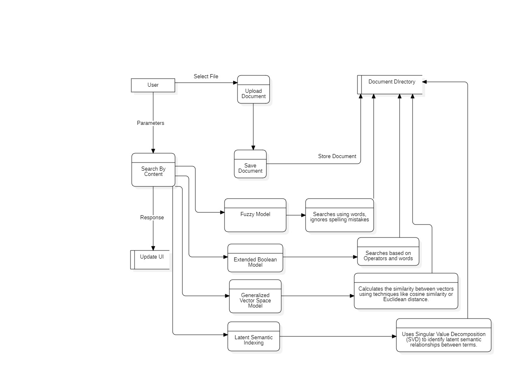
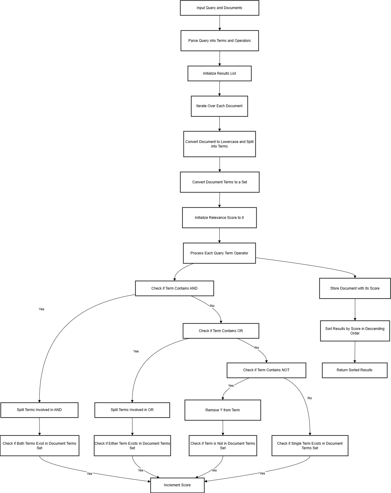

# DOCUMENT SEARCH ENGINE

## Session: 2021 – 2025

### Submitted by:

**Abdul Mateen**
*2021-CS-190*

### Submitted to:

**Dr. Khaldoon**

---

## Department of Computer Science

University of Engineering and Technology
Lahore, Pakistan

---

# Document Search Engine  

## Introduction  

This document provides a comprehensive explanation of the Document Search Engine, including its architecture, data flow, and modular code representation. The system allows users to upload documents, index their content, and perform efficient searches using various retrieval models. Results are presented with matching filenames and content snippets, ranked by relevance.  

---

## Overview  

The Document Search Engine is a Django-based application built using Python. It enables users to upload and process documents, apply advanced search algorithms, and retrieve results ranked by relevance. The engine incorporates three primary models for search: the Binary Independence Model, Non-Overlapped Lists, and Proximal Nodes.  


## Tech Stack

- **Django**: A web framework for Python to build web applications.
- **HTML/CSS**: For frontend to create the user interface.
- **JavaScript**: For handling dynamic interactions (e.g., PDF viewer integration).
- **Math**: For computing TF-IDF, cosine similarity, and other mathematical operations.

---

# Installation Guide

Follow these steps to set up the project from scratch.

### Clone the Project

```
git clone https://github.com/abdulmateenzwl/Information-Retrieval.git
cd Information-Retrieval
cd "Assignment 3"
```

### Create a Virtual Environment

Create a virtual environment to manage your project dependencies:

```bash
python3 -m venv venv
```

Activate the virtual environment:

```
venv\Scripts\activate
```

Install Required Dependencies
Install all necessary Python libraries using pip. You can use the requirements.txt file to install the dependencies:

```
pip install -r requirements.txt
```

### Directory Structure

Ensure your project has the following directory structure:

```
project_root/
│
├── manage.py                     # Django project management script
├── requirements.txt              # Python dependencies (optional)
├── db.sqlite3                    # SQLite database (or any other database in use)
│
├── static/                       # Static files (CSS, JavaScript, images)
│   ├── css/
│   ├── js/
│   └── images/
│
├── templates/                    # HTML templates
│   ├── base.html                 # Base template for layout inheritance
│   └── search_engine/
│       └── search.html
│
├── media/                        # Media files (user uploads)
│
├── search_engine/                      # Main project folder (same name as the project)
│   ├── __init__.py
│   ├── asgi.py
│   ├── settings.py               # Project settings
│   ├── urls.py                   # Project-level URL configuration
│   ├── wsgi.py
│   └── static/                   # Optional: project-level static files
│
├── search_engine/                     # Django app directory
│   ├── migrations/               # Database migrations
│   │   ├── __init__.py
│   │   └── 0001_initial.py
│   ├── static/                   # App-specific static files
│   │   └── search_engine/
│   │       ├── css/
│   │       └── js/
│   ├── templates/                # App-specific templates
│   │   └── search_engine/
│   │       └── example.html
│   ├── __init__.py
│   ├── admin.py                  # Admin site configuration
│   ├── apps.py                   # App configuration
│   ├── models.py                 # Database models
│   ├── tests.py                  # Unit tests
│   ├── views.py                  # Views (business logic)
│   ├── urls.py                   # App-specific URL configuration
│   └── forms.py                  # Optional: Django forms
│
└── docs/                         # Documentation (optional)
    ├── README.md
    └── PPT.ppt
```

### Running the Application

Run the Django application with the following command:

```
python manage.py runserver
```

The app will be accessible at http://localhost:8000/.
## Project Overview  

### Core Features  

#### **File Uploading**  

- Users can upload `.txt` files, which are saved in the `documents/` directory.  
- Uploaded files are immediately processed, and their content is stored in a dictionary for efficient indexing and retrieval.  

#### **Document Indexing**  

- The app preprocesses documents to normalize content by converting text to lowercase, removing duplicates, and splitting it into individual terms.  
- Documents are indexed using advanced models like the **Binary Independence Model**, **Non-Overlapped List Model**, and **Proximal Nodes Retrieval** to enable specialized search functionality.  

---

## Search Models  

The Document Search Engine incorporates three distinct search models to offer flexibility and accuracy in content retrieval:  

### **1. Binary Independence Model (BIM)**  
The Binary Independence Model calculates the relevance of a document based on its overlap with the search query.  

**Key Features:**  
- Preprocesses the query and documents to remove case sensitivity and normalize content.  
- Scores documents based on the count of matching terms between the query and document.  
- Filters out documents with minimal matching terms to ensure relevance.  

**Implementation Workflow:**  
1. Tokenize and preprocess all documents and the query.  
2. Calculate the number of query terms that overlap with each document.  
3. Rank the documents based on their overlap scores, discarding documents with a score of zero.  

---

### **2. Non-Overlapped List Model**  
This model retrieves documents based on individual query terms and organizes them into separate non-overlapping lists for each term.  

**Key Features:**  
- Splits the search query into individual terms.  
- Identifies documents containing each term independently.  
- Groups results into a dictionary where each query term maps to a list of document IDs containing that term.  

**Implementation Workflow:**  
1. Tokenize the search query into terms.  
2. Search each term within the document content.  
3. Return a mapping of query terms to document IDs for precise result segregation.  

---

### **3. Proximal Nodes Model**  
The Proximal Nodes Model uses a predefined graph structure to identify related terms and locate documents based on the relationships between words.  

**Key Features:**  
- Incorporates a graph structure that maps terms to their semantically related terms.  
- Matches documents containing either the query term or its related terms from the graph.  
- Enhances the retrieval process by considering semantic proximity rather than exact matches.  

**Implementation Workflow:**  
1. Retrieve related terms for the query term from the graph.  
2. Search for the query term and related terms across all documents.  
3. Return a dictionary of relevant document IDs and their content.  

### File Uploading:

- Users can upload `.txt` files. These documents are saved in the `documents/` directory.
- Uploaded files are processed immediately to extract their content, which is stored in the `documents` dictionary.

### Document Indexing:

- The app uses the **TF-IDF model** to index documents by content.
- Stop words are removed from the indexing process to ensure only meaningful terms are indexed.
- Cosine similarity is used to rank documents based on the relevance of the search query.

### Search Functionality:

- Users can search for keywords or phrases within document content or filenames.
- The search results are ranked by relevance, with the most relevant results displayed first.


### **Search Results**  

- Results are ranked by relevance based on the search model applied.  
- For models like BIM, results are sorted by overlap scores, with higher scores indicating better matches.  
- Non-Overlapped Lists and Proximal Nodes return well-organized lists or mappings of documents to ensure clear and relevant results.  

---

## Example Use Case  

1. **Uploading Documents:**  
   A user uploads a collection of `.txt` files containing textual content. These documents are indexed and stored in the system.  

2. **Performing a Search:**  
   The user enters a query and selects the desired search model (BIM, Non-Overlapped Lists, or Proximal Nodes).  

3. **Retrieving Results:**  
   The system processes the query using the chosen model and displays ranked results with filenames and content snippets.  

---

## Technical Details  

- **Programming Language:** Python  
- **Framework:** Django  
- **Search Algorithms:**  
  - Binary Independence Model  
  - Non-Overlapped List Model  
  - Proximal Nodes Retrieval  
- **Data Storage:** Files are stored in the `documents/` directory, and their content is stored in a Python dictionary for efficient processing.  
- **Preprocessing:** Tokenization, case normalization, and duplicate removal ensure consistent and clean data for indexing.  

---

## Code Explanation

### Main Application (`main.py`)

#### Import Statements

```python
from django.shortcuts import render
from .utils import read_documents, keyword_matching, calculate_tf_idf
```

#### Django Setup

```python
INSTALLED_APPS = [
    'search_engine',
    'django.contrib.admin',
    'django.contrib.auth',
    'django.contrib.contenttypes',
    'django.contrib.sessions',
    'django.contrib.messages',
    'django.contrib.staticfiles',
]
```

#### Global Variables

```python
# Initialize indexes when the server starts
INDEX, TITLE_INDEX, DOCUMENTS = build_index()
```

#### Document Reading

The read_documents function reads and processes all text files in a specified upload directory and stores their content in a global dictionary for indexing and search operations.

Example:

```python
{
  "file1.txt": {"content": "Text file content"},
  "file2.txt": {"content": "Second Doc"},
  "file3.txt": {"content": "Third Doc"}
}
```


### Working

#### Build Index

```py
# Function to perform Boolean Extended search
def boolean_extended_search(query, documents):
    """
    Perform Boolean Extended search with AND, OR, NOT operations.
    Returns a list of tuples where each tuple contains a document and its relevance score.
    """

    # Convert the query into a list of terms and operators
    query = parse_boolean_query(query)
    
    results = []  # Initialize a list to store results along with relevance scores
    
     # Iterate through each document in the dataset
    for doc in documents:
        doc_terms = doc.lower().split()   # Convert the document to lowercase and split into individual words (terms)
        doc_terms_set = set(doc_terms)  # Convert terms to a set for quick lookup
        score = 0  # Initialize the relevance score
        
        # Process the query terms and operators
        terms = query.split()  # Split query into individual terms/operators

        for term in terms:  
            if '&' in term:  # Check if the term involves an AND operation
                term1, term2 = term.split('&') # Split terms involved in AND
                if term1 in doc_terms_set and term2 in doc_terms_set:
                    score += 1  # Increment score if both terms are found
            elif '|' in term:  # Check if the term involves an OR operation
                term1, term2 = term.split('|') # Split terms involved in OR
                if term1 in doc_terms_set or term2 in doc_terms_set:
                    score += 1 # Increment score if either term is found
            elif '!' in term:  # Check if the term involves a NOT operation
                term1 = term[1:]  # Remove the '!' to get the term
                if term1 not in doc_terms_set:
                    score += 1  # Increment score if the term is NOT in the document
            else:  # Single term (assume it is ANDed with the rest)
                if term in doc_terms_set:
                    score += 1 # Increment score if the term is found

        # Store documents with their score
        results.append((doc, score))

    # Sort results in descending order based on score (higher score means more relevant)
    results.sort(key=lambda x: x[1], reverse=True)
    return results
```

#### Upload File
```python
@csrf_exempt
def upload_file_view(request):
    """
    Handle file uploads.
    Accepts .txt files and updates the index upon successful upload.
    """
    if request.method == 'POST' and request.FILES.get('file'):
        uploaded_file = request.FILES['file']

        # Validate the uploaded file type
        if not uploaded_file.name.endswith('.txt'):
            return JsonResponse({'success': False, 'message': 'Only .txt files are allowed.'})

        # Save the file to the DOCUMENTS_DIR
        file_path = os.path.join(DOCUMENTS_DIR, uploaded_file.name)
        with open(file_path, 'wb') as f:
            for chunk in uploaded_file.chunks():
                f.write(chunk)

        # Update the index with the new file
        update_index(file_path, uploaded_file.name)

        return JsonResponse({'success': True, 'message': 'File uploaded and index updated successfully.'})

    # Respond with an error for invalid requests
    return JsonResponse({'success': False, 'message': 'Invalid request.'})

```

## DFD




#### Explanation

**Overview**  
This diagram illustrates the process of a Boolean Information Retrieval System. The system takes a query and a set of documents and returns a ranked list of documents relevant to the query based on Boolean operators (AND, OR, NOT).

**Steps**  

1. **Input Query and Documents:**  
   The system receives a query in the form of a Boolean expression and a set of documents.

2. **Parse Query into Terms and Operators:**  
   The query is parsed into individual terms and Boolean operators (AND, OR, NOT) that connect them.

3. **Initialize Results List:**  
   An empty list is initialized to store the relevant documents and their corresponding scores.

4. **Iterate Over Each Document:**  
   The system iterates through each document in the collection.

5. **Convert Document to Lowercase and Split into Terms:**  
   Each document is converted to lowercase and split into individual terms.

6. **Convert Document Terms to a Set:**  
   The document terms are converted into a set to improve efficiency in subsequent operations.

7. **Initialize Relevance Score to 0:**  
   A relevance score is initialized to 0 for the current document.

8. **Process Each Query Term and Operator:**  
   The system processes each term and operator in the query:  
   * **AND:** Both terms must be present in the document's terms.  
   * **OR:** At least one of the terms must be present in the document's terms.  
   * **NOT:** The term must not be present in the document's terms.  
   * **Single Term:** The term is checked for presence in the document's terms.  

9. **Increment Score:**  
   If a term or combination of terms matches the document, the relevance score is incremented.

10. **Store Document with its Score:**  
    The document and its calculated score are stored in the results list.

11. **Sort Results by Score in Descending Order:**  
    The results list is sorted in descending order based on the relevance scores.

12. **Return Sorted Results:**  
    The sorted list of relevant documents is returned as the system's output.

**Components**  
* **User:** The person interacting with the system to input a query and view results.  
* **Query Parser:** Parses the Boolean expression into terms and operators.  
* **Document Collection:** A set of documents against which the query is matched.  
* **Relevance Scorer:** Evaluates and calculates relevance scores for documents based on the query.  
* **Results Manager:** Stores and sorts the results to display to the user.  

**Data Flows**  
* **Query Input:** The query provided by the user is sent to the Query Parser.  
* **Documents:** The collection of documents is sent to the Relevance Scorer.  
* **Relevance Scores:** Calculated scores are passed to the Results Manager.  
* **Sorted Results:** The final ranked list is returned to the user.

## Future Enhancements

In the future, we plan to enhance the document search engine by supporting various document formats beyond plain text files. This includes adding support for PDF, Word, and Excel documents, allowing users to upload and search within these file types. Additionally, we aim to improve the search algorithms to provide more accurate and relevant results, and to integrate advanced features such as natural language processing and semantic search capabilities. These enhancements will make the search engine more versatile and powerful, catering to a wider range of user needs and document types.