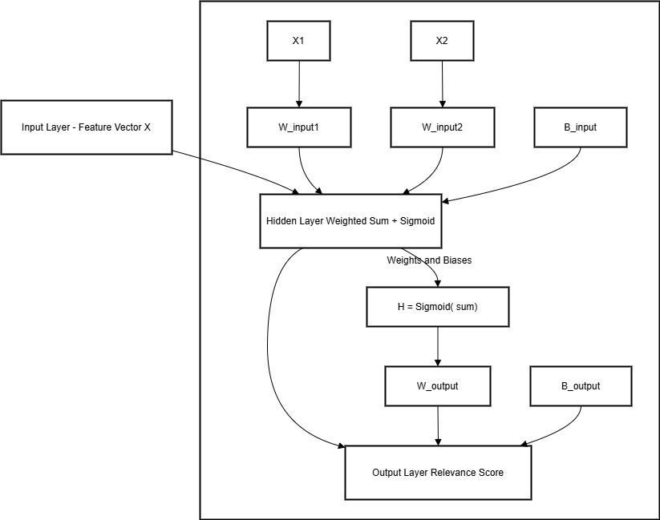

# Neural Network for Information Retrieval

This project implements a simplified feed-forward neural network to calculate a **relevance score** for a document-query pair in an Information Retrieval (IR) system. The code is written in Python without relying on external libraries such as NumPy, showcasing the basics of neural networks and IR.

## Features

- **Text Preprocessing**: Processes input queries to extract keywords and context.
- **Semantic Understanding**: Interprets the meaning of keywords and considers synonyms for better search accuracy.
- **Query Expansion**: Expands the input query to include related terms for more comprehensive search results.
- **Search and Retrieval**: Ranks documents based on a relevance score computed by the neural network.

## How it Works

The neural network is structured as follows:

1. **Input Layer**:
   - Accepts a feature vector `X` representing the query and document attributes.
   - Example input features: `X1` (e.g., keyword frequency), `X2` (e.g., semantic similarity).

2. **Hidden Layer**:
   - Computes a weighted sum of input features and applies a sigmoid activation function.
   - Formula:  
     ```
     H = Sigmoid(W_input * X + B_input)
     ```
     - `W_input`: Weights for the input layer.
     - `B_input`: Bias for the hidden layer.

3. **Output Layer**:
   - Uses the hidden layer output to compute the final relevance score.
   - Formula:  
     ```
     Relevance Score = W_output * H + B_output
     ```
     - `W_output`: Weight for the output layer.
     - `B_output`: Bias for the output layer.

4. **Activation Function**:
   - The sigmoid function squashes the output of the hidden layer to a range between 0 and 1.

## Example

In this project, the following values are used for demonstration:

- **Input Features**:  
  `X1 = 0.7`, `X2 = 0.5`
- **Hidden Layer Parameters**:  
  Weights: `W_input1 = 0.8`, `W_input2 = 0.6`, Bias: `B_input = 0.2`
- **Output Layer Parameters**:  
  Weight: `W_output = 1.5`, Bias: `B_output = -0.4`

### Computation:

1. **Hidden Layer Output**:  
   ```
   H = Sigmoid(0.8 * 0.7 + 0.6 * 0.5 + 0.2)
     = Sigmoid(1.06)
     ≈ 0.742
   ```

2. **Relevance Score**:  
   ```
   Relevance Score = 1.5 * 0.742 - 0.4
                   ≈ 0.713
   ```

### Output:
```
Relevance Score: 0.713
```

## DFD


### Explanation

# Neural Network Diagram Explanation

## Overview
This project implements a simple feed-forward neural network with the following structure:

1. **Input Layer**: Takes a feature vector `X` as input.
2. **Hidden Layer**: Computes a weighted sum of the inputs, adds a bias, and applies a sigmoid activation function.
3. **Output Layer**: Computes the relevance score by applying weights and a bias to the hidden layer output.

---

### Neural Network Architecture

#### **Input Layer**
- Feature Vector: `X = [X1, X2]`

#### **Hidden Layer**
- Weighted Sum:
  - \( \text{Sum} = (X1 \times W\_input1) + (X2 \times W\_input2) + B\_input \)
- Activation Function:
  - \( H = \text{Sigmoid(Sum)} \)

#### **Output Layer**
- Relevance Score:
  - \( \text{Relevance Score} = (H \times W\_output) + B\_output \)

---

### Diagram Explanation

1. **Input Layer**:
   - Receives `X1` and `X2`.
   - Each input is weighted by `W_input1` and `W_input2`, respectively.
   - A bias `B_input` is added.

2. **Hidden Layer**:
   - Computes the weighted sum.
   - Applies the sigmoid function to produce `H`.

3. **Output Layer**:
   - Multiplies `H` by `W_output`.
   - Adds the bias `B_output`.
   - Outputs the final relevance score.

---

### Key Components in the Diagram

1. **Input Nodes**: Represent `X1` and `X2`.
2. **Weights (`W_input1`, `W_input2`)**: Scale the input features.
3. **Bias (`B_input`, `B_output`)**: Adjust the output to fit better.
4. **Hidden Layer Activation (`Sigmoid`)**: Introduces non-linearity.
5. **Output Layer**: Produces the final result (Relevance Score).


## Usage

1. Clone this repository.
2. Run the Python script using any Python 3.x environment:
   ```bash
   python neural_network_ir.py
   ```
3. The script will output the computed relevance score.

## Concepts Learned

- Fundamentals of neural networks for IR.
- Feed-forward neural network with hidden and output layers.
- Activation functions (sigmoid).
- Manual implementation of dot products and matrix operations.

## Future Work

- Extend the network to include multiple hidden layers for complex queries.
- Introduce advanced features like dynamic query expansion or semantic embeddings.
- Train the network with real-world data for adaptive learning.
