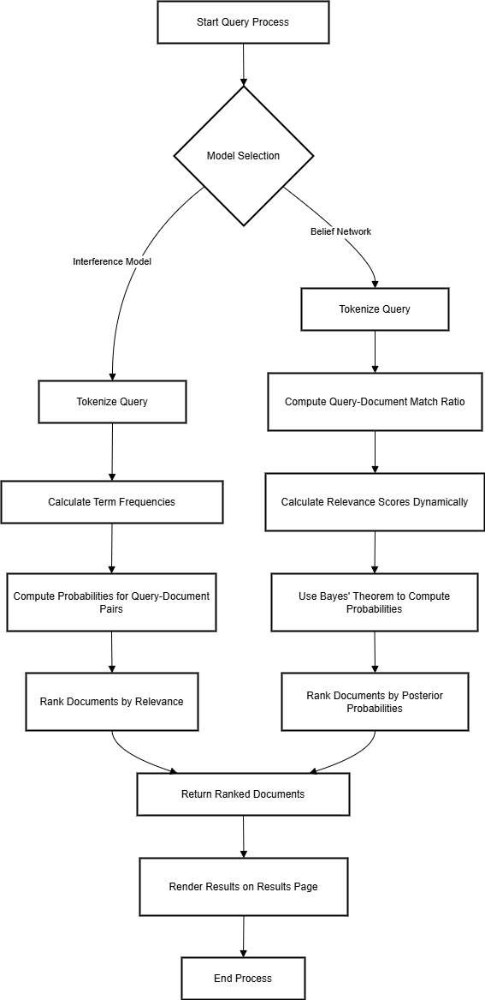

# DOCUMENT SEARCH ENGINE

## Session: 2021 – 2025

### Submitted by:

**Abdul Mateen**
*2021-CS-190*

### Submitted to:

**Dr. Khaldoon**

---

## Department of Computer Science

University of Engineering and Technology
Lahore, Pakistan

---

# Document Search Engine  

## Introduction  

This document provides a comprehensive explanation of the Document Search Engine, including its architecture, data flow, and modular code representation. The system allows users to upload documents, index their content, and perform efficient searches using various retrieval models. Results are presented with matching filenames and content snippets, ranked by relevance.  

---

## Overview  

The Document Search Engine is a Django-based application built using Python. It enables users to upload and process documents, apply advanced search algorithms, and retrieve results ranked by relevance. The engine incorporates three primary models for search: the Belief Network, Interference Models.  


## Tech Stack

- **Flask**: A web framework for Python to build web applications.
- **HTML/CSS**: For frontend to create the user interface.
- **JavaScript**: For handling dynamic interactions (e.g., PDF viewer integration).
- **Math**: For computing TF-IDF, cosine similarity, and other mathematical operations.

---

# Installation Guide

Follow these steps to set up the project from scratch.

### Clone the Project

```
git clone https://github.com/abdulmateenzwl/Information-Retrieval.git
cd Information-Retrieval
cd "Assignment 3"
```

### Create a Virtual Environment

Create a virtual environment to manage your project dependencies:

```bash
python3 -m venv venv
```

Activate the virtual environment:

```
venv\Scripts\activate
```

Install Required Dependencies
Install all necessary Python libraries using pip. You can use the requirements.txt file to install the dependencies:

```
pip install -r requirements.txt
```

### Directory Structure

Ensure your project has the following directory structure:

```
project_root/
│
├── manage.py                     # Django project management script
├── requirements.txt              # Python dependencies (optional)
├── db.sqlite3                    # SQLite database (or any other database in use)
│
├── static/                       # Static files (CSS, JavaScript, images)
│   ├── css/
│   ├── js/
│   └── images/
│
├── templates/                    # HTML templates
│   ├── base.html                 # Base template for layout inheritance
│   └── search_engine/
│       └── search.html
│
├── media/                        # Media files (user uploads)
│
├── search_engine/                      # Main project folder (same name as the project)
│   ├── __init__.py
│   ├── asgi.py
│   ├── settings.py               # Project settings
│   ├── urls.py                   # Project-level URL configuration
│   ├── wsgi.py
│   └── static/                   # Optional: project-level static files
│
├── search_engine/                     # Django app directory
│   ├── migrations/               # Database migrations
│   │   ├── __init__.py
│   │   └── 0001_initial.py
│   ├── static/                   # App-specific static files
│   │   └── search_engine/
│   │       ├── css/
│   │       └── js/
│   ├── templates/                # App-specific templates
│   │   └── search_engine/
│   │       └── example.html
│   ├── __init__.py
│   ├── admin.py                  # Admin site configuration
│   ├── apps.py                   # App configuration
│   ├── models.py                 # Database models
│   ├── tests.py                  # Unit tests
│   ├── views.py                  # Views (business logic)
│   ├── urls.py                   # App-specific URL configuration
│   └── forms.py                  # Optional: Django forms
│
└── docs/                         # Documentation (optional)
    ├── README.md
    └── PPT.ppt
```

### Running the Application

Run the Django application with the following command:

```
python manage.py runserver
```

The app will be accessible at http://localhost:8000/.
## Project Overview  

### Core Features  

#### **File Uploading**  

- Users can upload `.txt` files, which are saved in the `documents/` directory.  
- Uploaded files are immediately processed, and their content is stored in a dictionary for efficient indexing and retrieval.  

#### **Document Indexing**  

- The app preprocesses documents to normalize content by converting text to lowercase, removing duplicates, and splitting it into individual terms.  
- Documents are indexed using advanced models like the **Interference Modal**, **Belief Network** to enable specialized search functionality.  

---

## Search Models  

## Search Models
The Document Search Engine incorporates two distinct search models to offer flexibility and accuracy in content retrieval:

### 1. Interference Model
The Interference Model calculates the relevance of a document based on term frequency and query-document match ratio.

#### Key Features:

Tokenizes and preprocesses the query and documents.
Calculates term frequency for each document.
Computes probabilities for query-document pairs.
Ranks documents based on their relevance probabilities.
#### Implementation Workflow:
Tokenize and preprocess all documents and the query.
Calculate term frequency for each document.
Compute probabilities for query-document pairs.
Rank the documents based on their relevance probabilities.

### 2. Belief Network
The Belief Network dynamically calculates relevance scores based on the user query using Bayes' theorem.

#### Key Features:

Tokenizes and preprocesses the query and documents.
Computes query-document match ratio.
Calculates joint and marginal probabilities.
Uses Bayes' theorem to compute posterior probabilities.
Ranks documents based on their posterior probabilities.
#### Implementation Workflow:

Tokenize and preprocess all documents and the query.
Compute query-document match ratio.
Calculate joint and marginal probabilities.
Use Bayes' theorem to compute posterior probabilities.
Rank the documents based on their posterior probabilities.

### File Uploading:

- Users can upload `.txt` files. These documents are saved in the `documents/` directory.
- Uploaded files are processed immediately to extract their content, which is stored in the `documents` dictionary.

### Document Indexing:

- The app uses the **TF-IDF model** to index documents by content.
- Stop words are removed from the indexing process to ensure only meaningful terms are indexed.
- Cosine similarity is used to rank documents based on the relevance of the search query.

### Search Functionality:

- Users can search for keywords or phrases within document content or filenames.
- The search results are ranked by relevance, with the most relevant results displayed first.


### **Search Results**  

- Results are ranked by relevance based on the search model applied.  
- For models like BIM, results are sorted by overlap scores, with higher scores indicating better matches.  
- Non-Overlapped Lists and Proximal Nodes return well-organized lists or mappings of documents to ensure clear and relevant results.  

---

## Example Use Case  

- Uploading Documents:
A user uploads a collection of .txt files containing textual content. These documents are indexed and stored in the system.

- Performing a Search:
The user enters a query and selects the desired search model (Interference or Belief Network).

- Retrieving Results:
The system processes the query using the chosen model and displays ranked results with filenames and content snippets.

---

## Technical Details  
- Programming Language: Python
- Framework: Flask
- Search Algorithms:
    - Interference Model
    - Belief Network
- Data Storage: Documents are stored in a Python dictionary for efficient processing.
- Preprocessing: Tokenization, case normalization, and duplicate removal ensure consistent and clean data for indexing.

---

## Code Explanation

### Main Application (`main.py`)


#### Document Reading

The read_documents function reads and processes all text files in a specified upload directory and stores their content in a global dictionary for indexing and search operations.

Example:

```python
{
  "file1.txt": {"content": "Text file content"},
  "file2.txt": {"content": "Second Doc"},
  "file3.txt": {"content": "Third Doc"}
}
```


### Working

## DFD



#### Explanation

**Overview**
This DFD depicts a system designed for managing and retrieving documents. It illustrates how users interact with the system to upload, store, and search for documents.

**Components**

* **Search By Title/Content:** Process that takes user-provided parameters (search query) and searches the Document Directory for matching documents.
* **Save Document:** Process that saves the document in the Document Directory.
* **Search using Keyword Matching:** Process that employs keyword matching to find documents containing the search query.
* **Display Results:** Process that displays search results to the user.

**Data Flows**

* **Select File:** User selects a file for upload.
* **Parameters:** User provides parameters (search query) to the search process.
* **Search Query:** Search query is passed to the search process.
* **Response:** Search results are displayed to the user.
* **Store Document:** Uploaded document is stored in the Document Directory.

**Functionality**

1. **Document Upload:** User selects a file for upload. The system receives the file and stores it in the Document Directory.
2. **Document Search:** User provides a search query (by title or content). The system searches the Document Directory using keyword matching to find documents containing the search query.
3. **Display Results:** System displays the search results to the user, highlighting the matching lines in the document content.


**Components**:

* User: Represents the end-user who interacts with the system.
* Upload Document: This process receives documents from the user and stores them in the Document Directory.
* Document Directory: This is where uploaded documents are stored.
* Search By Content: This process takes parameters (search query) from the user and searches the Document Directory for matching documents.
* Save Document: This process saves the document in the Document Directory.
* Binary Independence Model: Searches based on probability, independent of other documents.
* Proximal Node Model: Searches through interconnected nodes.
* Non-Overlapping Model: Searches through clusters.

**Data Flows**:
# Key Steps in the Query Process

## 1. Start Query Process
The process begins with a user initiating a search.

---

## 2. Model Selection
The system determines which retrieval model to use based on the query and the available resources.

### Options:
- **Belief Network**
- **Interference Model**

---

## 3. Tokenization
The query is broken down into individual words or tokens for further processing.

---

## 4. Term Frequency Calculation
The frequency of each term in the query is calculated.

---

## 5. Query-Document Match Ratio Calculation
The similarity between the query and each document in the collection is computed.

---

## 6. Relevance Score Calculation
Documents are assigned relevance scores based on their match with the query.

### Methods:
- **Interference Model**: Computing probabilities for query-document pairs.
- **Belief Network**: Using Bayes' Theorem to calculate posterior probabilities.

---

## 7. Document Ranking
Documents are ranked based on their relevance scores.

---

## 8. Return Ranked Documents
The top-ranked documents are presented to the user.

---

## 9. Render Results
The search results are displayed on the user interface.

---

## 10. End Process
The query process concludes.


**Functionality**:
* Document Upload: The user selects a file to upload. The system receives the file and stores it in the Document Directory.
* Document Search: The user provides a search query. The system searches the Document Directory using different models (Binary Independence, Proximal Node, and Non-Overlapping) to rank the matching documents.
* Display Results: The system displays the ranked search results to the user.

## Future Enhancements

In the future, we plan to enhance the document search engine by supporting various document formats beyond plain text files. This includes adding support for PDF, Word, and Excel documents, allowing users to upload and search within these file types. Additionally, we aim to improve the search algorithms to provide more accurate and relevant results, and to integrate advanced features such as natural language processing and semantic search capabilities. These enhancements will make the search engine more versatile and powerful, catering to a wider range of user needs and document types.